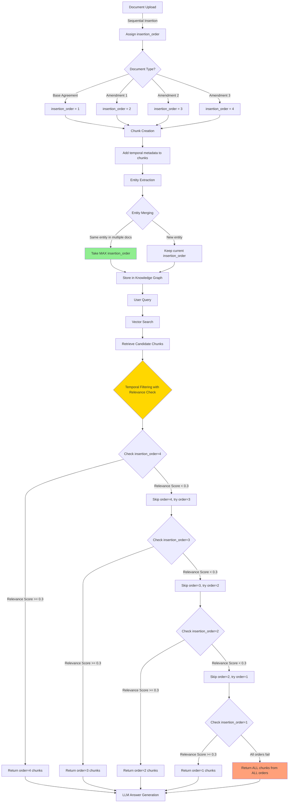
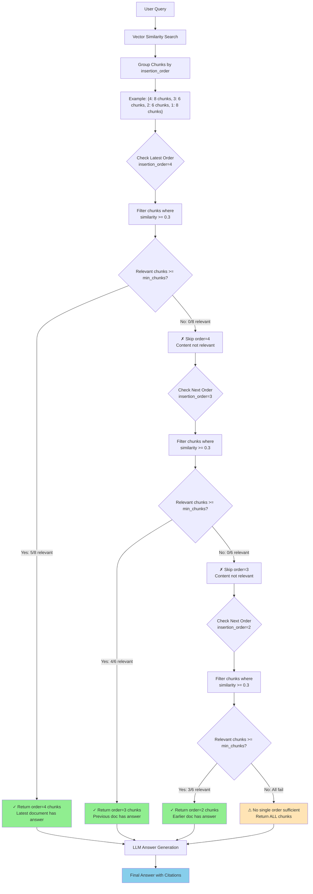
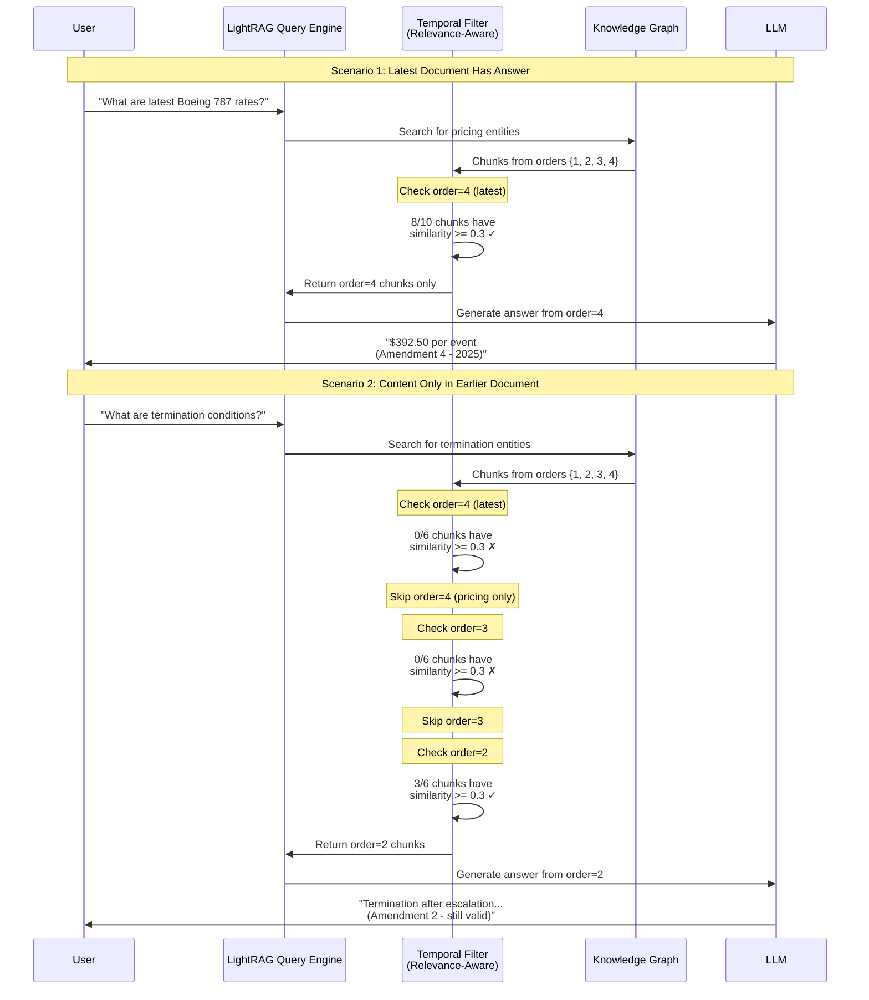

# Chronological Contract RAG - Implementation Guide

> **Last Updated:** December 31, 2025  
> **Status:** ✅ Production Ready

## Table of Contents

- [Overview](#overview)
- [Key Features](#key-features)
- [Architecture](#architecture)
- [Implementation Details](#implementation-details)
- [Usage Examples](#usage-examples)
- [API Reference](#api-reference)
- [Testing & Debugging](#testing--debugging)
- [Design Decisions](#design-decisions)
- [Migration Paths](#migration-paths)
- [Performance Considerations](#performance-considerations)

---

## Overview

This implementation extends LightRAG with **temporal tracking** capabilities, enabling chronological document management for contract RAG use cases. The system automatically tracks document insertion order and maintains entity/relationship recency with intelligent relevance-aware filtering.

**Key Principle:** Later documents supersede earlier ones when they contain the same information. The system intelligently falls back to earlier documents when content doesn't exist in newer versions.

---

## Key Features

### 1. Automatic Insertion Order Tracking
- Every document upload receives a sequential `insertion_order` (auto-incrementing counter)
- Every document gets an `insertion_timestamp` (Unix timestamp)
- No manual metadata extraction required—simply upload documents in chronological order

### 2. Temporal Metadata Propagation
Temporal information flows through the entire pipeline:
```
Document → Chunks → Entities → Relationships → Graph Storage
```

Each level preserves:
- `insertion_order`: Sequential number indicating document position in chronology
- `insertion_timestamp`: When the document was inserted
- `update_history`: List of all source chunk IDs that contributed to the entity/relationship

### 3. Entity-Level Recency with Update History
When the same entity appears in multiple documents:
- The system keeps the **maximum** `insertion_order` (most recent)
- Entity descriptions are merged using LLM summarization
- `update_history` tracks ALL source chunks (full audit trail)
- No chunk deduplication—same text in different documents is preserved (for legal compliance)

### 4. Relevance-Aware Temporal Filtering
The system intelligently selects chunks based on both **recency** and **relevance**:
- Tries the most recent document (highest insertion_order) first
- Only accepts chunks that meet a minimum similarity threshold (default: 0.3)
- Falls back to earlier documents if recent ones lack relevant content
- Returns all chunks across all orders if no single order is sufficient

### 5. NetworkX Storage Extensions
New methods added to `NetworkXStorage`:
- `get_entities_by_recency(entity_names, return_latest_only=True)`: Retrieve only the most recent version of each entity
- `get_entity_history(entity_name)`: Get complete update history for an entity
- `get_entities_at_time(insertion_order)`: Point-in-time entity retrieval
- `filter_entities_by_order(...)`: Filter entities by insertion order range
- `detect_entity_changes(...)`: Detect changes between two versions
- `create_supersedes_relationship(...)`: Create explicit supersession links
- `get_document_chain(doc_id)`: Get full version chain

### 6. Session Persistence
The insertion counter is saved to the NetworkX graph metadata and restored on initialization, maintaining chronology across restarts.

---

## Architecture

### Complete Data Flow



### Relevance-Aware Temporal Filtering Logic



### Query Routing: Content-Aware Document Selection



---

## Implementation Details

### Modified Files and Core Components

#### `lightrag/lightrag.py`
Core temporal tracking initialization and persistence:
- `_document_insertion_counter`: Auto-incrementing counter for insertion order
- Counter restoration from graph metadata in `initialize_storages()`
- Temporal metadata injection into chunks during document processing
- Counter persistence in `_insert_done()`

#### `lightrag/kg/networkx_impl.py`
Extended graph storage with temporal capabilities:
- `upsert_node()`: Intelligent temporal field merging
  - `update_history`: Combines and deduplicates chunk IDs
  - `insertion_order`: Keeps maximum (most recent)
  - `insertion_timestamp`: Keeps maximum (most recent)
- `upsert_edge()`: Same temporal handling for relationships
- Temporal query methods (see API Reference)

#### `lightrag/operate.py`
Entity extraction and temporal filtering:
- `_handle_single_entity_extraction()`: Propagates temporal metadata
- `_handle_single_relationship_extraction()`: Propagates temporal metadata
- `_merge_nodes_then_upsert()`: Extracts MAX insertion_order from all nodes
- `_merge_edges_then_upsert()`: Extracts MAX insertion_order from all edges
- `_apply_temporal_chunk_filtering()`: **Relevance-aware filtering** with progressive fallback
- `extract_table_semantic_text()`: HTML table parsing for better vector search

### Temporal Filtering Algorithm

The relevance-aware temporal filtering follows this logic:

1. **Group chunks by insertion_order**
2. **For each order (from highest to lowest)**:
   - Filter chunks where `similarity >= relevance_threshold` (default 0.3)
   - If `relevant_chunks >= min_chunks`: Return all chunks from this order
   - Else: Skip to next lower order
3. **Ultimate fallback**: If no single order is sufficient, return ALL chunks
4. **LLM processing**: Generate answer from selected chunks

This ensures:
- ✅ Recent documents are preferred when they contain relevant information
- ✅ System falls back to earlier documents when content isn't in latest versions
- ✅ No hallucination from irrelevant boilerplate text
- ✅ Full audit trail preserved across all documents

---

## Usage Examples

### Basic Sequential Insertion

```python
from lightrag import LightRAG, QueryParam

# Initialize with NetworkX storage
rag = LightRAG(
    working_dir="./contract_rag_storage",
    llm_model_func=llm_model_func,
    embedding_func=embedding_func,
)

await rag.initialize_storages()

# Insert documents in chronological order
documents = [
    "Base Agreement content from 2020...",
    "Amendment 1 content from 2021...",
    "Addendum 1 content from 2022...",
    "Amendment 2 content from 2025...",
]

for i, doc_content in enumerate(documents):
    await rag.ainsert(
        doc_content,
        file_paths=f"Document_{i+1}.pdf"
    )
    # insertion_order is automatically tracked: 1, 2, 3, 4

await rag.finalize_storages()
```

### Querying with Temporal Awareness

```python
# Standard query (will use most recent information)
result = await rag.aquery(
    "What are the current rates for Widget X?",
    param=QueryParam(mode="mix")  # Recommended: combines KG + vector chunks
)
# Returns: $12 from Amendment 2 (2025) - most recent

# Query for historical information
result = await rag.aquery(
    "What were the 2022 payment terms?",
    param=QueryParam(mode="mix")
)
# Returns: Net 45 days from Addendum 1 (2022)
```

### Accessing Temporal Metadata Directly

```python
# Get graph storage
graph = rag.chunk_entity_relation_graph

# Check entity history
entity_name = "Widget X"
history = await graph.get_entity_history(entity_name)
print(f"Insertion Order: {history['insertion_order']}")
print(f"Update Count: {history['update_count']}")
print(f"Update History: {history['update_history']}")

# Get only latest versions of entities
entity_names = ["Widget X", "Widget Y", "Termination Clause"]
latest_entities = await graph.get_entities_by_recency(
    entity_names,
    return_latest_only=True
)
```

---

## API Reference

### Temporal Query Methods

```python
# Get entities at a specific point in time
await graph.get_entities_at_time(insertion_order=2)
# Returns: {entity_name: entity_data} for entities existing at/before order 2

# Filter entities by insertion order range
await graph.filter_entities_by_order(
    entity_data=entities_list,
    min_insertion_order=1,
    max_insertion_order=3
)
# Returns: Filtered list of entities within the order range

# Detect changes between two time points
await graph.detect_entity_changes(
    entity_name="Widget X",
    order1=1,  # Earlier time
    order2=4   # Later time
)
# Returns: {entity_name, changed, state_at_order1, state_at_order2, description_diff}
```

### Document Relationship Methods

```python
# Create explicit supersession relationship
await graph.create_supersedes_relationship(
    prev_doc_id="Base_Agreement_2020.txt",
    new_doc_id="Amendment_1_2021.txt",
    prev_insertion_order=1,
    new_insertion_order=2
)

# Get full document chain
chain = await graph.get_document_chain("Base_Agreement_2020.txt")
# Returns: [{prev_doc, new_doc, insertion_order, description}, ...]
```

### Document Type Inference

```python
# Automatically infer document type from first page content and filename
# Content analysis is more reliable and takes precedence over filename
doc_type = rag._infer_document_type(
    file_path="Amendment_1_2021.txt",
    content=document_content  # First ~1500 chars analyzed
)
# Returns: 'amendment'

# Supported types with content-based pattern detection:
# - 'base_agreement': Detects "MASTER AGREEMENT", "SERVICE AGREEMENT", "WHEREAS"
# - 'amendment': Detects "AMENDMENT NO.", "FIRST AMENDMENT", "THIS AMENDMENT"
# - 'addendum': Detects "ADDENDUM NO.", "THIS ADDENDUM", "SUPPLEMENTAL AGREEMENT"
# - 'exhibit': Detects "EXHIBIT A/B/C", "SCHEDULE A/B", "ATTACHMENT"
# - 'unknown': Default when no patterns match
```

---

## Testing & Debugging

### Query Debugging Script

Use the included debug script to inspect each step of query execution:

```bash
# Run with full debugging output
python debug_query.py "What are the latest Boeing 787 rates?"

# Debug specific query modes
python debug_query.py "Contract termination?" --mode hybrid

# Adjust temporal filtering parameters
python debug_query.py "Your query" --relevance-threshold 0.4
```

The debug script provides:
- ✓ Vector search results with similarity scores
- ✓ Temporal filtering decisions for each insertion_order
- ✓ Entity and relationship extraction details
- ✓ Chunk selection and merging process
- ✓ Final context sent to LLM
- ✓ Complete execution timeline

See [debug_query.py](debug_query.py) for full documentation.

### Production Testing

After initial setup:

1. **Delete existing graph** to force re-indexing:
   ```bash
   rm -rf ./data/storage/*.json
   ```

2. **Rebuild the graph** with your documents:
   ```bash
   python build_graph.py
   ```

3. **Run queries** to verify temporal behavior:
   ```bash
   python query_graph.py
   ```

4. **Verify entity metadata** programmatically:
   ```python
   graph = rag.chunk_entity_relation_graph
   entity_data = await graph.get_entity_history("Boeing 787")
   print(f"Insertion Order: {entity_data['insertion_order']}")  # Should be highest
   ```

---

---

## Design Decisions

### 1. Chunk-Level No-Deduplication
When the same clause appears in multiple documents, both chunks are kept with different `insertion_order` values. This ensures:
- ✅ Full legal compliance and audit trail
- ✅ Ability to trace which document contained which version
- ✅ No information loss

### 2. Entity-Level Recency with Merging
When extracting entities from multiple chunks:
- Entities with the same name are merged
- The **maximum** `insertion_order` is retained (most recent)
- Descriptions are combined and summarized by LLM
- `update_history` preserves all contributing chunk IDs

This approach ensures:
- ✅ Latest information is prominently surfaced
- ✅ Historical context is preserved in update_history
- ✅ Efficient querying without manual date filtering

### 3. Relevance-Aware Temporal Filtering
Instead of blindly selecting the latest document:
- System checks if chunks from latest order are actually relevant (similarity >= 0.3)
- Falls back to earlier documents if latest lacks relevant content
- Returns all chunks across all orders if no single order is sufficient
- LLM intelligently extracts answer from the appropriate source

Benefits:
- ✅ No hallucination from irrelevant boilerplate
- ✅ Correct answers even when content moved/removed in later versions
- ✅ Transparent decision-making with detailed logging

### 4. Automatic Chronology (No Manual Date Extraction)
Instead of parsing dates from document content or filenames:
- Sequential insertion order serves as the chronology
- Users upload documents in order (BA → Amd1 → Add1 → Amd2)
- System automatically assigns `insertion_order`: 1, 2, 3, 4
- Simpler and more reliable than LLM-based date extraction

---

## Migration Paths

### PostgreSQL Migration

The implementation is designed for easy PostgreSQL migration:

**Temporal Field Mappings:**
- `insertion_order` → `BIGINT` column with index
- `insertion_timestamp` → `TIMESTAMP` type
- `update_history` → `TEXT[]` array type

**Required PostgreSQL Schema:**
```sql
-- Add to nodes table
ALTER TABLE nodes ADD COLUMN insertion_order BIGINT;
ALTER TABLE nodes ADD COLUMN insertion_timestamp TIMESTAMP;
ALTER TABLE nodes ADD COLUMN update_history TEXT[];
CREATE INDEX idx_nodes_insertion_order ON nodes(insertion_order);

-- Add to edges table
ALTER TABLE edges ADD COLUMN insertion_order BIGINT;
ALTER TABLE edges ADD COLUMN insertion_timestamp TIMESTAMP;
ALTER TABLE edges ADD COLUMN update_history TEXT[];
CREATE INDEX idx_edges_insertion_order ON edges(insertion_order);
```

**PostgreSQL Query Methods:**
```python
# In lightrag/kg/postgres_impl.py
async def get_entities_by_recency(self, entity_names: list[str], return_latest_only: bool = True):
    query = """
        SELECT DISTINCT ON (entity_name) *
        FROM nodes
        WHERE entity_name = ANY($1)
        ORDER BY entity_name, insertion_order DESC NULLS LAST
    """ if return_latest_only else """
        SELECT * FROM nodes WHERE entity_name = ANY($1)
    """
    return await self.execute(query, entity_names)
```

### AWS Neptune Support

Neptune uses Gremlin query language:

```groovy
// Get latest entity version
g.V().has('entity_name', entityName)
     .order().by('insertion_order', desc)
     .limit(1)

// Get entity history
g.V().has('entity_name', entityName)
     .values('update_history', 'insertion_order', 'insertion_timestamp')
```

---

## Performance Considerations

### NetworkX (In-Memory)
- ✅ Excellent for development and datasets <10,000 documents
- ✅ Fast temporal queries with Python dict operations
- ⚠️ Memory constraints with large chronologies
- 💡 **Solution**: Partition by date ranges or migrate to PostgreSQL

### PostgreSQL
- ✅ Handles millions of documents
- ✅ Efficient indexing on `insertion_order`
- ✅ Native array support for `update_history`
- ✅ SQL window functions for temporal analysis

### AWS Neptune
- ✅ Distributed architecture for massive scale
- ✅ Graph-native traversals for relationship queries
- ✅ Built-in sharding and replication

---

## Query Modes

When querying your chronological RAG, use these modes:

- **`hybrid`** ✅ **Recommended**: Combines knowledge graph (entities + relationships) + vector chunks
- **`local`**: Only local entities and their relationships
- **`global`**: Only global relationships and connected entities
- **`naive`**: Basic vector search without knowledge graph

---

## Conclusion

This implementation provides a production-ready foundation for chronological contract RAG with intelligent content-aware temporal filtering. The system automatically handles:

✨ **Automatic temporal tracking**: Just upload documents in order
✨ **Smart document selection**: Returns the right document based on content relevance
✨ **Entity recency management**: Always surfaces the latest version
✨ **Full audit trails**: Complete update history for compliance

**Key Principle**: The system understands both **time** (insertion order) and **content** (relevance), ensuring accurate answers while preserving legal audit trails.

Simply insert your documents in chronological order, and the system handles the rest! 🚀
