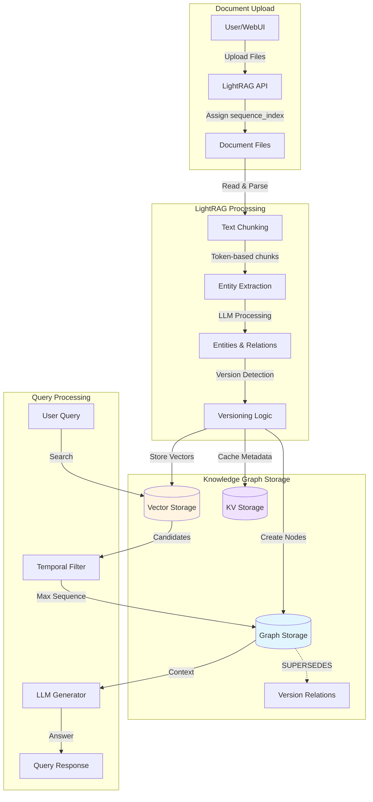

# LightRAG Temporal Architecture

## Overview

LightRAG's temporal capabilities are built on two foundational architectural principles: **Split-Node** and **Sequence-First**. These design patterns enable version-aware knowledge management and time-sensitive information retrieval.

---

## Core Architectural Principles

### 1. Split-Node Architecture

Instead of updating entities in place, LightRAG creates **separate versioned nodes** for each distinct version of an entity or relationship. This approach:

- **Preserves historical context**: All previous versions remain accessible
- **Enables temporal queries**: Users can retrieve information as it existed at specific points in time
- **Supports audit trails**: Complete change history is maintained in the graph
- **Prevents data loss**: No information is overwritten or deleted

**Example:**
```
"Parking Fee" mentioned in Document A (2024-01-01) → Node: "Parking Fee [v1]"
"Parking Fee" updated in Document B (2025-06-15) → Node: "Parking Fee [v2]"

Relationship: "Parking Fee [v2]" --SUPERSEDES--> "Parking Fee [v1]"
```

### 2. Sequence-First Architecture

Documents are assigned monotonically increasing sequence IDs during ingestion. This sequencing:

- **Establishes temporal ordering**: Even without explicit dates, documents have a definitive order
- **Simplifies version resolution**: Higher sequence numbers represent more recent information
- **Supports incremental updates**: New documents extend the sequence without reprocessing
- **Enables deterministic retrieval**: Queries consistently return the "latest" version

**Sequence Assignment:**
```json
{
  "contract_2023_Q1.pdf": 1,
  "amendment_2024_Q2.pdf": 2,
  "latest_rates_2025.pdf": 3
}
```

---

## Data Lifecycle: From Upload to Knowledge Graph

The following diagram illustrates the complete journey of data through the LightRAG temporal system:



---

## Detailed Processing Pipeline

### Stage 1: Document Upload & Sequencing
- **Input**: PDF files, Word documents, text files
- **Process**: Files are uploaded to the staging area
- **Output**: Each file receives a unique sequence ID in chronological order

### Stage 2: Metadata Extraction & Tagging
- **Input**: Sequenced documents
- **Process**: NLP pipeline extracts:
  - Effective dates (via regex or LLM)
  - Document type classifications
  - Contract metadata
- **Output**: Documents enriched with XML tags like `<EFFECTIVE_DATE>2025-06-15</EFFECTIVE_DATE>`

### Stage 3: LightRAG Ingestion
- **Input**: Tagged documents with sequence IDs
- **Process**: 
  - Text chunking based on semantic boundaries
  - Entity and relationship extraction using LLMs
  - Version detection through entity name matching
- **Output**: Structured knowledge ready for graph insertion

### Stage 4: Entity Extraction & Versioning
- **Input**: Extracted entities and relationships
- **Process**:
  - Group entities by canonical name (e.g., "Parking Fee")
  - Compare with existing graph nodes
  - Create new versioned nodes when content differs
  - Generate SUPERSEDES relationships
- **Output**: Versioned entity nodes with temporal metadata

### Stage 5: Knowledge Graph Storage
- **Input**: Versioned nodes and relationships
- **Storage Options**:
  - **NetworkX**: In-memory graph (default)
  - **Neo4j**: Production-grade graph database
  - **ArangoDB**: Multi-model database
  - **FalkorDB**: Redis-based graph storage
- **Query Interface**: Vector search combined with temporal filtering

---

## Version Management Strategy

### Node Versioning Schema

Each versioned node contains:

```json
{
  "entity_name": "Parking Fee",
  "sequence_index": 2,
  "source_id": "amendment_2024_Q2.pdf",
  "effective_date": "2025-06-15",
  "content": "Parking fee is $100 per night...",
  "version_label": "v2"
}
```

### Relationship Types

1. **SUPERSEDES**: Links newer versions to older ones
   ```
   "Entity [v2]" --SUPERSEDES--> "Entity [v1]"
   ```

2. **REFERENCES**: Links entities mentioned together
   ```
   "Boeing 787" --MENTIONED_WITH--> "Lavatory Service"
   ```

3. **TEMPORAL_CONTEXT**: Associates entities with time periods
   ```
   "Rate Policy [v3]" --EFFECTIVE_FROM--> "2025-01-01"
   ```

---

## Design Philosophy

This architecture follows these core design principles:

**1. Sequence-First Approach**
- Sequence index is the primary ordering mechanism
- Higher sequence = more recent information
- Simple, deterministic version resolution

**2. Soft Tagging for Temporal Context**
- Effective dates are embedded in content as `<EFFECTIVE_DATE>` tags
- LLM interprets dates during generation, not during retrieval
- Preserves nuance: "This rate is agreed but not yet active"

**3. Split-Node Strategy**
- Each document version creates separate entity nodes
- No data loss from overwrites or merges
- Complete audit trail through SUPERSEDES relationships

**4. Content-Centric Storage**
- All temporal information lives in content or tags
- No external temporal metadata engines required
- Scales with standard vector databases

---

### 1. Time-Travel Queries
Users can query the knowledge base as it existed at any point in time:
```
"What was the parking fee on 2023-01-01?" → Returns v1
"What is the current parking fee?" → Returns v2
```

### 2. Complete Audit Trails
The SUPERSEDES graph enables:
- Historical records of all changes
- Diff visualization between versions
- Compliance verification with timestamps

### 3. Conflict Resolution
When multiple documents update the same entity:
- Highest sequence ID is authoritative
- Soft tags preserve future-dated clauses
- Manual override available via API

### 4. Scalability
- Append-only writes (no updates, no deletes)
- Efficient vector search on latest versions
- Historical versions available but not hot in index

---

---

## Integration with LightRAG Core

The temporal extensions integrate seamlessly with LightRAG's existing architecture:

| **Component**          | **Temporal Enhancement**                          |
|------------------------|---------------------------------------------------|
| `lightrag.py`          | Accepts `sequence_map` and `reference_date`       |
| `operate.py`           | Implements max-sequence filtering                 |
| `kg/` storage adapters | Store sequence_index and effective_date metadata  |
| `llm/` prompt modules  | Inject temporal context into prompts              |
| Vector database        | Indexes both content and temporal metadata        |

---

## Configuration

Enable temporal mode in `config.ini`:

```ini
[temporal]
enabled = true
sequence_first = true
track_effective_dates = true
max_versions_per_entity = 10
```

Or via environment variables:

```bash
export LIGHTRAG_TEMPORAL_ENABLED=true
export LIGHTRAG_SEQUENCE_FIRST=true
```

---

## Next Steps

- **For retrieval details**: See [RETRIEVAL_LOGIC.md](RETRIEVAL_LOGIC.md)
- **For user instructions**: See [USER_GUIDE.md](USER_GUIDE.md)
- **For API documentation**: See [API_REFERENCE.md](API_REFERENCE.md)
- **For WebUI features**: See [WEBUI_FEATURES.md](WEBUI_FEATURES.md)

---

**Last Updated:** March 5, 2026

**Architecture designed for the aviation industry use case, extensible to any temporal knowledge domain.**
