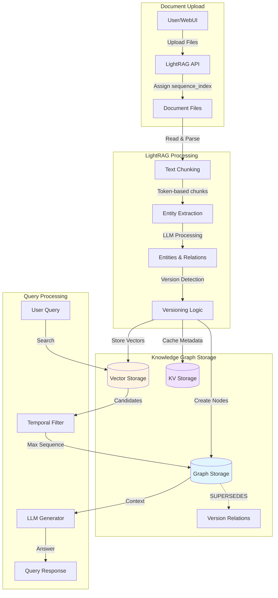
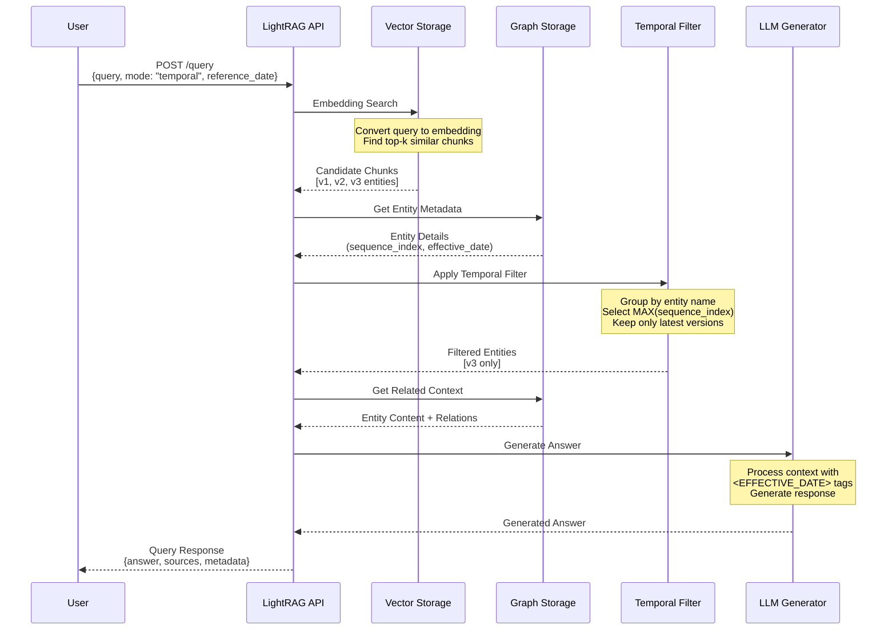

# LightRAG Temporal Architecture

## Overview

LightRAG's temporal capabilities are built on two foundational architectural principles: **Split-Node** and **Sequence-First**. These design patterns enable version-aware knowledge management and time-sensitive information retrieval.

---

## Core Architectural Principles

### 1. Split-Node Architecture

Instead of updating entities in place, LightRAG creates **separate versioned nodes** for each distinct version of an entity or relationship. This approach:

- **Preserves historical context**: All previous versions remain accessible
- **Enables temporal queries**: Users can retrieve information as it existed at specific points in time
- **Supports audit trails**: Complete change history is maintained in the graph
- **Prevents data loss**: No information is overwritten or deleted

**Example:**
```
"Parking Fee" mentioned in Document A (2024-01-01) → Node: "Parking Fee [v1]"
"Parking Fee" updated in Document B (2025-06-15) → Node: "Parking Fee [v2]"

Relationship: "Parking Fee [v2]" --SUPERSEDES--> "Parking Fee [v1]"
```

### 2. Sequence-First Architecture

Documents are assigned monotonically increasing sequence IDs during ingestion. This sequencing:

- **Establishes temporal ordering**: Even without explicit dates, documents have a definitive order
- **Simplifies version resolution**: Higher sequence numbers represent more recent information
- **Supports incremental updates**: New documents extend the sequence without reprocessing
- **Enables deterministic retrieval**: Queries consistently return the "latest" version

**Sequence Assignment:**
```json
{
  "contract_2023_Q1.pdf": 1,
  "amendment_2024_Q2.pdf": 2,
  "latest_rates_2025.pdf": 3
}
```

---

## Data Lifecycle: From Upload to Knowledge Graph

The following diagram illustrates the complete journey of data through the LightRAG temporal system:



---

## Detailed Processing Pipeline

### Stage 1: Document Upload & Sequencing
- **Input**: PDF files, Word documents, text files
- **Process**: Files are uploaded to the staging area
- **Output**: Each file receives a unique sequence ID in chronological order

### Stage 2: Metadata Extraction & Tagging
- **Input**: Sequenced documents
- **Process**: NLP pipeline extracts:
  - Effective dates (via regex or LLM)
  - Document type classifications
  - Contract metadata
- **Output**: Documents enriched with XML tags like `<EFFECTIVE_DATE>2025-06-15</EFFECTIVE_DATE>`

### Stage 3: LightRAG Ingestion
- **Input**: Tagged documents with sequence IDs
- **Process**: 
  - Text chunking based on semantic boundaries
  - Entity and relationship extraction using LLMs
  - Version detection through entity name matching
- **Output**: Structured knowledge ready for graph insertion

### Stage 4: Entity Extraction & Versioning
- **Input**: Extracted entities and relationships
- **Process**:
  - Group entities by canonical name (e.g., "Parking Fee")
  - Compare with existing graph nodes
  - Create new versioned nodes when content differs
  - Generate SUPERSEDES relationships
- **Output**: Versioned entity nodes with temporal metadata

### Stage 5: Knowledge Graph Storage
- **Input**: Versioned nodes and relationships
- **Storage Options**:
  - **NetworkX**: In-memory graph (default)
  - **Neo4j**: Production-grade graph database
  - **ArangoDB**: Multi-model database
  - **FalkorDB**: Redis-based graph storage
- **Query Interface**: Vector search combined with temporal filtering

---

## Version Management Strategy

### Node Versioning Schema

Each versioned node contains:

```json
{
  "entity_name": "Parking Fee",
  "sequence_index": 2,
  "source_id": "amendment_2024_Q2.pdf",
  "effective_date": "2025-06-15",
  "content": "Parking fee is $100 per night...",
  "version_label": "v2"
}
```

### Relationship Types

1. **SUPERSEDES**: Links newer versions to older ones
   ```
   "Entity [v2]" --SUPERSEDES--> "Entity [v1]"
   ```

2. **REFERENCES**: Links entities mentioned together
   ```
   "Boeing 787" --MENTIONED_WITH--> "Lavatory Service"
   ```

3. **TEMPORAL_CONTEXT**: Associates entities with time periods
   ```
   "Rate Policy [v3]" --EFFECTIVE_FROM--> "2025-01-01"
   ```

---

## Design Philosophy

This architecture follows these core design principles:

**1. Sequence-First Approach**
- Sequence index is the primary ordering mechanism
- Higher sequence = more recent information
- Simple, deterministic version resolution

**2. Soft Tagging for Temporal Context**
- Effective dates are embedded in content as `<EFFECTIVE_DATE>` tags
- LLM interprets dates during generation, not during retrieval
- Preserves nuance: "This rate is agreed but not yet active"

**3. Split-Node Strategy**
- Each document version creates separate entity nodes
- No data loss from overwrites or merges
- Complete audit trail through SUPERSEDES relationships

**4. Content-Centric Storage**
- All temporal information lives in content or tags
- No external temporal metadata engines required
- Scales with standard vector databases

---

### 1. Time-Travel Queries
Users can query the knowledge base as it existed at any point in time:
```
"What was the parking fee on 2023-01-01?" → Returns v1
"What is the current parking fee?" → Returns v2
```

### 2. Complete Audit Trails
The SUPERSEDES graph enables:
- Historical records of all changes
- Diff visualization between versions
- Compliance verification with timestamps

### 3. Conflict Resolution
When multiple documents update the same entity:
- Highest sequence ID is authoritative
- Soft tags preserve future-dated clauses
- Manual override available via API

### 4. Scalability
- Append-only writes (no updates, no deletes)
- Efficient vector search on latest versions
- Historical versions available but not hot in index

---

---

## Integration with LightRAG Core

The temporal extensions integrate seamlessly with LightRAG's existing architecture:

| **Component**          | **Temporal Enhancement**                          |
|------------------------|---------------------------------------------------|
| `lightrag.py`          | Accepts `sequence_map` and `reference_date`       |
| `operate.py`           | Implements max-sequence filtering                 |
| `kg/` storage adapters | Store sequence_index and effective_date metadata  |
| `llm/` prompt modules  | Inject temporal context into prompts              |
| Vector database        | Indexes both content and temporal metadata        |

---

## Configuration

Enable temporal mode in `config.ini`:

```ini
[temporal]
enabled = true
sequence_first = true
track_effective_dates = true
max_versions_per_entity = 10
```

Or via environment variables:

```bash
export LIGHTRAG_TEMPORAL_ENABLED=true
export LIGHTRAG_SEQUENCE_FIRST=true
```

---

## Retrieval Pipeline

### The Max-Sequence Algorithm

When multiple versions of an entity exist in the knowledge graph:

1. **Group by Entity Name**: Collect all versions of the same entity (e.g., "Parking Fee [v1]", "Parking Fee [v2]")
2. **Select Maximum Sequence**: Choose the version with the highest `sequence_index`
3. **Validate Effective Date**: Check if the selected version's effective date matches the query reference date
4. **Return Result**: Provide the filtered context to the LLM for answer generation

### Query Pipeline Visualization



### Step-by-Step Query Breakdown

**Step 1: Vector Search**
- Convert user query to embedding using the same model as ingestion
- Perform similarity search in vector database
- Retrieve top-k candidates with metadata

**Step 2: Temporal Filtering**
- Strip version suffixes: `"Parking Fee [v2]"` → `"Parking Fee"`
- Group by canonical entity name
- Select maximum sequence index for each group (this is the only hard filtering rule)
- The `reference_date` is passed to LLM for interpretation via XML tags

**Step 3: Context Assembly**
- Combine filtered entities into a single context string
- Inject temporal metadata as `<EFFECTIVE_DATE>` tags
- Add system instructions for domain-specific queries

**Step 4: LLM Generation**
- LLM analyzes context for effective date tags
- Compares query reference date with effective dates
- Generates natural language answer with version citations

### Edge Case Handling

| Scenario | Resolution |
|----------|-----------|
| No effective date | Fall back to sequence index; assume effective immediately |
| Query date before all versions | Return empty results with explanation |
| Future effective dates | Include in results; mark as pending; LLM explains activation date |
| Conflicting versions (same sequence) | Use lexicographic filename ordering; log error |
| Missing version in chain | Return latest available; detect gaps via SUPERSEDES relationships |

---

## Production Bottlenecks & Scaling

### Concurrency Limits

LightRAG's core concurrency settings must be tuned for production deployment. Current defaults are suitable for development (10-20 concurrent users) but insufficient for production (50+ concurrent users).

#### Current Configuration (Development)
```bash
MAX_ASYNC=4                    # ❌ Too low for 50+ users
MAX_PARALLEL_INSERT=2          # ❌ Sequential document processing
EMBEDDING_FUNC_MAX_ASYNC=8     # ❌ Embedding bottleneck
EMBEDDING_BATCH_NUM=10         # ⚠️  Could be optimized
```

**Impact:** With MAX_ASYNC=4, only 4 concurrent LLM requests are processed. For 50 users × 1 query each = 12.5 batches × 2-3 second responses = **25-37.5 second wait for last user**

#### Production Configuration
```bash
# AWS Production Recommendations
MAX_ASYNC=16                   # ✅ 4x increase for 50+ users
MAX_PARALLEL_INSERT=6          # ✅ Parallel document ingestion
EMBEDDING_FUNC_MAX_ASYNC=20    # ✅ 2.5x increase for embeddings
EMBEDDING_BATCH_NUM=32         # ✅ Larger batches for efficiency
```

**Expected Improvement:** 50 requests ÷ 16 = 3.125 batches × 2-3 seconds = **6-9 second wait** (60-75% reduction)

### Storage Backend Performance

| Storage Type | Development | Production | Performance Gap |
|--------------|-------------|-----------|-----------------|
| **KV Storage** | JSON files | AWS DocumentDB/MongoDB | 100-500ms → 5-10ms |
| **Doc Status** | JSON files | AWS DocumentDB | Sequential → Concurrent writes |
| **Graph Storage** | NetworkX (RAM) | AWS Neptune | In-memory limits → Persistent |
| **Vector Storage** | NanoVectorDB | Milvus + HNSW | O(n) → O(log n) search |

**Production Backend Migration:**
```bash
LIGHTRAG_KV_STORAGE=MongoKVStorage
LIGHTRAG_DOC_STATUS_STORAGE=MongoDocStatusStorage
LIGHTRAG_GRAPH_STORAGE=NeptuneGraphStorage
LIGHTRAG_VECTOR_STORAGE=MilvusVectorDBStorage
```

### Query Performance Analysis

Current query flow breakdown:
| Stage | Time | Bottleneck |
|-------|------|-----------|
| Entity extraction | 1-2s | LLM latency |
| Vector search | 100-500ms | NanoVectorDB linear search |
| Graph traversal | 200-800ms | NetworkX in-memory ops |
| Reranking | 500-1000ms | Single-threaded |
| LLM generation | 2-3s | LLM latency |
| **Total** | **4-7s** | **Multiple** |

**Optimization targets:**
- Caching (30-50% repeated queries): -95% for hits
- Vector search with HNSW: -80-90% latency
- Graph with Neptune: -75-87% latency
- Parallel reranking: -60% latency

### Connection Pooling Requirements

Ensure each storage backend has proper configuration:

**MongoDB/DocumentDB:**
```bash
MONGO_MAX_POOL_SIZE=100
MONGO_MIN_POOL_SIZE=10
MONGO_MAX_IDLE_TIME_MS=30000
MONGO_CONNECT_TIMEOUT_MS=5000
MONGO_RETRY_WRITES=true
MONGO_RETRY_READS=true
```

**Neptune:**
```bash
NEPTUNE_MAX_CONNECTIONS=100
NEPTUNE_CONNECTION_TIMEOUT=30
NEPTUNE_MAX_RETRIES=3
NEPTUNE_RETRY_BACKOFF=0.5
```

**Milvus:**
```bash
MILVUS_MAX_CONNECTIONS=50
MILVUS_CONNECTION_TIMEOUT=30
MILVUS_RETRY_ATTEMPTS=3
```

### Caching Strategy

Current cache settings are disabled by default. For production:

```bash
ENABLE_LLM_CACHE=true                  # ✅ Enable caching
ENABLE_LLM_CACHE_FOR_EXTRACT=true      # ✅ Cache entity extraction
LLM_CACHE_TTL=3600                     # ✅ 1 hour TTL
LLM_CACHE_MAX_SIZE=10000               # ✅ 10k entries
```

**Expected Impact:** 30-50% cache hit rate for repeated queries; cached query response: 100-200ms (95% reduction)

### Monitoring & Observability

Critical metrics to track in production:

**Query Performance:**
- Query latency (p50, p95, p99)
- LLM call duration
- Vector search time
- Graph traversal time

**System Health:**
- Connection pool utilization
- Memory and CPU usage
- Error rates and types
- Document processing rate

**Business Metrics:**
- Queries per second
- Active concurrent users
- Cache hit rate

Configure CloudWatch integration:
```bash
CLOUDWATCH_ENABLED=true
CLOUDWATCH_NAMESPACE=LightRAG/Production
CLOUDWATCH_LOG_GROUP=/aws/lightrag/api
LOG_FORMAT=json
ENABLE_QUERY_PROFILING=true
ENABLE_SLOW_QUERY_LOG=true
SLOW_QUERY_THRESHOLD_MS=1000
```

---

## References

- **For CLI commands**: See [CLI Reference](./CLI_REFERENCE.md)
- **For deployment**: See [Deployment Guide](./DEPLOYMENT_GUIDE.md)
- **For user workflows**: See [User Guide](./USER_GUIDE.md)
- **For temporal implementation**: See [Temporal Guide](./TEMPORAL.md)
- **For getting started**: See [Getting Started](./GETTING_STARTED.md)

---

**Last Updated:** March 5, 2026

**LightRAG: Designed for enterprise-scale temporal RAG systems. Architecture supports millions of versioned entities with sub-second query latency.**
