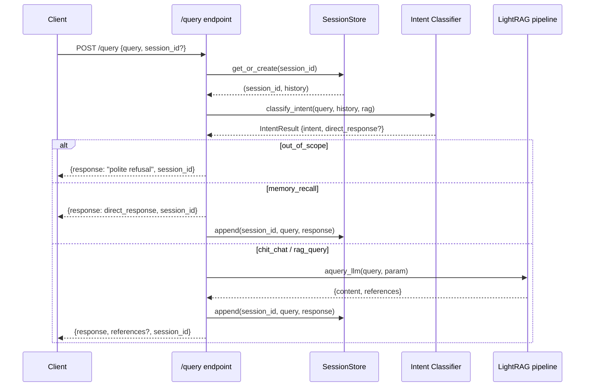

# Chat-Based Session System

**Transforms LightRAG's stateless Q&A API into a multi-turn conversational assistant**

Latest: March 2026 | Branch: `feat/chatbot`

---

## Overview

LightRAG's query API was originally stateless — each `POST /query` call was independent with no memory of prior exchanges. The chat implementation adds four capabilities on top of the existing RAG pipeline:

| Capability | What it does |
|---|---|
| **Sessions** | Tracks conversation history across multiple turns per user |
| **Intent classification** | Routes each message to the right handler before (or instead of) RAG |
| **Chit-chat** | Responds conversationally without touching the knowledge base |
| **Memory recall** | Answers "what did I ask earlier?" from the session history |
| **Out-of-scope refusal** | Politely declines off-domain questions |

All of this is layered onto the existing `/query` and `/query/stream` endpoints — no new URL prefix was introduced.

---

## Architecture

```
POST /query  (or /query/stream)
  │
  ├─ 1. Load or create session  ──────────────── SessionStore
  │         stored_history + request.conversation_history
  │
  ├─ 2. Classify intent  ─────────────────────── LLM call (single prompt)
  │         rag_query | chit_chat | memory_recall | out_of_scope
  │
  ├─ 3. Route
  │         out_of_scope   → return polite refusal (no LLM, no session write)
  │         memory_recall  → return synthesised answer (no RAG)
  │         chit_chat      → mode="bypass", run aquery_llm with history
  │         rag_query      → normal RAG pipeline with history as context
  │
  └─ 4. Append exchange to session → return session_id in response
```

### Request / response flow



---

## New Files

### `lightrag/api/chat_session.py`

In-memory session store. Imported as a module-level singleton:

```python
from lightrag.api.chat_session import session_store
```

#### `SessionData`

```python
@dataclass
class SessionData:
    history: List[Dict[str, str]]   # [{"role": "user"|"assistant", "content": "..."}]
    created_at: float
    last_accessed: float
```

#### `SessionStore`

| Method | Description |
|---|---|
| `get_or_create(session_id)` | Returns `(session_id, history)`. Creates a new UUID session if `session_id` is `None` or unknown. |
| `append(session_id, user_msg, assistant_msg)` | Adds a user/assistant exchange. Trims to `max_history` turns. |
| `get_history(session_id)` | Returns the full history list, or `[]` if not found. |
| `delete(session_id)` | Removes the session. Returns `True` if it existed. |
| `list_sessions()` | Returns all non-expired session IDs. |
| `_evict_expired()` | Called lazily on every access; removes sessions idle longer than `ttl_seconds`. |

#### Configuration

| Env variable | Default | Description |
|---|---|---|
| `CHAT_SESSION_TTL` | `3600` | Seconds of inactivity before a session is evicted |
| `CHAT_MAX_HISTORY` | `20` | Maximum conversation turns stored per session |

Sessions are stored in a plain Python `dict` — they are **lost on server restart**. This is intentional for simplicity; swap in a Redis-backed store if persistence is required.

---

### `lightrag/api/chat_intent.py`

LLM-based intent classifier. A single LLM call classifies each user message and (for non-RAG intents) synthesises a direct response.

#### `Intent` enum

```python
class Intent(str, Enum):
    RAG_QUERY      = "rag_query"
    CHIT_CHAT      = "chit_chat"
    MEMORY_RECALL  = "memory_recall"
    OUT_OF_SCOPE   = "out_of_scope"
```

#### `IntentResult`

```python
@dataclass
class IntentResult:
    intent: Intent
    direct_response: Optional[str]   # set for memory_recall and out_of_scope
```

#### `classify_intent(query, history, rag) → IntentResult`

1. Formats the last 3 conversation turns as plain text.
2. Sends a structured prompt to `rag.llm_model_func`.
3. Parses the JSON response — strips markdown code fences if present.
4. Falls back to `Intent.RAG_QUERY` on any error (bad JSON, unknown value, LLM exception) so the user always gets a response.

#### Classification prompt

```
You are an intent classifier for a {domain} knowledge assistant.
Classify the following user message into exactly one of:
  - rag_query     : requires searching the knowledge base
  - chit_chat     : casual conversation, greetings, thanks, general questions
  - memory_recall : user is asking about the current conversation history
  - out_of_scope  : topic is clearly outside the domain

Conversation so far (last 3 turns):
{last_turns}

User message: "{query}"

Respond with JSON only:
{"intent": "<intent>", "response": "<direct_response_if_not_rag_query>"}
```

For `rag_query` and `chit_chat`, `"response"` is `null`.
For `out_of_scope`, `"response"` is a polite single-sentence refusal.
For `memory_recall`, `"response"` synthesises an answer from the history shown above — so **no second LLM call is needed** in the route handler.

#### Configuration

| Env variable | Default | Description |
|---|---|---|
| `CHAT_INTENT_ENABLED` | `true` | Global default; overridden per-request via `enable_intent_classification` |
| `CHAT_DOMAIN_LABEL` | `"knowledge base"` | Domain label inserted into the classification prompt |

---

## Modified Files

### `lightrag/api/routers/query_routes.py`

#### New `QueryRequest` fields

```python
session_id: Optional[str] = Field(
    default=None,
    description="Session identifier. Omit to auto-create a new session.",
)
enable_intent_classification: Optional[bool] = Field(
    default=None,
    description="Run intent classification before RAG. Defaults to CHAT_INTENT_ENABLED env var.",
)
```

Both fields are excluded from `QueryParam` conversion so the underlying RAG pipeline never sees them.

#### New `QueryResponse` field

```python
session_id: Optional[str] = Field(
    default=None,
    description="Echo or newly-created session ID. Pass this in subsequent requests.",
)
```

#### New `StreamChunkResponse` field

```python
session_id: Optional[str] = Field(
    default=None,
    description="Session ID emitted in the first NDJSON chunk.",
)
```

#### Updated `create_query_routes` signature

```python
def create_query_routes(rag, api_key=None, top_k=60, store: SessionStore = None)
```

The function now creates a **fresh `APIRouter` instance** on every call so that different `store` closures do not collide when the function is called multiple times (e.g. in tests).

#### Handler logic (`/query` and `/query/stream`)

```
1. session_id, stored_history = _store.get_or_create(request.session_id)
2. merged_history = stored_history + (request.conversation_history or [])
3. Classify intent (or skip if enable_intent_classification=False)

4. Branch:
   out_of_scope   → return refusal immediately; do NOT update session
   memory_recall  → return direct_response; update session
   chit_chat      → param.mode = "bypass"; inject merged_history; call aquery_llm
   rag_query      → param.conversation_history = merged_history; call aquery_llm

5. _store.append(session_id, query, response)
6. Return response with session_id
```

For `/query/stream`, `session_id` is emitted in the **first NDJSON chunk** alongside any references. The full accumulated response text is appended to the session after the final chunk is yielded.

---

### `lightrag/api/lightrag_server.py`

```python
# Import the module-level singleton
from lightrag.api.chat_session import session_store

# Wire it into the query router
app.include_router(create_query_routes(rag, api_key, args.top_k, store=session_store))

# Session management endpoints (both require auth)
GET  /sessions/{session_id}   → returns {session_id, history}
DELETE /sessions/{session_id} → returns {session_id, status: "deleted"}
```

---

## Frontend Changes

### `src/api/lightrag.ts`

- `QueryRequest` gains `session_id?: string | null` and `enable_intent_classification?: boolean`
- `QueryResponse` gains `session_id?: string`
- `queryTextStream` gains an optional fourth parameter `onSessionId?: (id: string) => void` — called as soon as a chunk containing `session_id` is parsed
- `getSession(sessionId)` and `deleteSession(sessionId)` API helpers added
- `SessionHistoryResponse` and `SessionDeleteResponse` types exported

### `src/stores/settings.ts`

- `chatSessionId: string | null` added to persisted state (default `null`)
- `setChatSessionId(id)` action added
- `enable_intent_classification: true` added to `querySettings` defaults
- Storage version bumped to **22** with migration for existing users

### `src/features/RetrievalTesting.tsx`

- `session_id: chatSessionId || undefined` included in every query request
- Non-streaming: `response.session_id` saved to store after each response
- Streaming: `onSessionId` callback updates the store as soon as the first chunk arrives
- `clearMessages` now also resets `chatSessionId`
- New `newSession()` helper resets the session ID without clearing the chat history
- A `<RefreshCw>` button shows session status (green = active session) with a tooltip showing the short session ID; clicking it starts a fresh session

### `src/components/retrieval/QuerySettings.tsx`

- **Intent Classification** checkbox added — toggles `enable_intent_classification` per request

---

## API Reference

### `POST /query`

**Request additions:**

```json
{
  "query": "What is the refund policy?",
  "mode": "mix",
  "session_id": "a1b2c3d4-...",
  "enable_intent_classification": true
}
```

**Response additions:**

```json
{
  "response": "The refund policy states...",
  "session_id": "a1b2c3d4-..."
}
```

### `POST /query/stream`

First NDJSON chunk:
```json
{"session_id": "a1b2c3d4-...", "references": [...]}
```

Subsequent chunks:
```json
{"response": "The refund "}
{"response": "policy states..."}
```

### `GET /sessions/{session_id}`

```json
{
  "session_id": "a1b2c3d4-...",
  "history": [
    {"role": "user",      "content": "What is the refund policy?"},
    {"role": "assistant", "content": "The refund policy states..."},
    {"role": "user",      "content": "Can I get a cash refund?"},
    {"role": "assistant", "content": "Cash refunds are available..."}
  ]
}
```

Returns `404` if the session does not exist or has been evicted.

### `DELETE /sessions/{session_id}`

```json
{"session_id": "a1b2c3d4-...", "status": "deleted"}
```

Returns `404` if the session does not exist.

---

## Intent Routing Reference

| Intent | Trigger examples | RAG call? | Session updated? |
|---|---|---|---|
| `rag_query` | "What is the refund policy?", "How much does plan A cost?" | Yes | Yes |
| `chit_chat` | "Hi", "Thanks!", "How are you?" | No (bypass mode) | Yes |
| `memory_recall` | "What did I ask earlier?", "Remind me what we discussed" | No | Yes |
| `out_of_scope` | "Write me a poem", "What's the weather?" | No | No |

---

## Configuration Summary

All variables are read at startup via `get_env_value`. Defaults are used when variables are absent.

| Variable | File | Default | Description |
|---|---|---|---|
| `CHAT_SESSION_TTL` | `chat_session.py` | `3600` | Session expiry (seconds) |
| `CHAT_MAX_HISTORY` | `chat_session.py` | `20` | Max turns per session |
| `CHAT_INTENT_ENABLED` | `chat_intent.py` | `true` | Global default for intent classification |
| `CHAT_DOMAIN_LABEL` | `chat_intent.py` | `"knowledge base"` | Domain label in classifier prompt |

---

## Test Coverage

Two test files cover the implementation:

### `tests/test_chat_session.py` — 24 tests

| Class | Tests |
|---|---|
| `TestSessionStore` | new session, explicit ID, existing session retrieval, append + history, max-history trimming, delete, list, TTL eviction, eviction during get_or_create, isolation between sessions, append auto-creates session |
| `TestHelpers` | `_format_last_turns` empty + trim, `_parse_llm_json` clean + fenced |
| `TestClassifyIntent` | all 4 intents, fallback on invalid JSON, fallback on unknown intent, fallback on LLM exception, markdown fence stripping |

### `tests/test_query_routes_chat.py` — 15 tests

| Class | Tests |
|---|---|
| `TestQueryRouteSession` | new session created, session echoed, history grows, response content, intent disabled, out-of-scope refusal (no session write), memory recall, chit-chat |
| `TestQueryStreamSession` | session_id in first chunk, cross-turn continuity, out-of-scope direct response |
| `TestSessionEndpoints` | GET history, GET 404, DELETE session, DELETE 404 |

Run all tests:
```bash
source .venv/bin/activate
python -m pytest tests/test_chat_session.py tests/test_query_routes_chat.py -v
```

Expected: **39 passed**.

---

## Design Decisions

**Why not a `/chat` prefix?**
The plan specified enhancing existing endpoints. This keeps backwards compatibility — existing clients that omit `session_id` simply get a stateless response (with a new `session_id` they can ignore).

**Why in-memory sessions?**
Simplicity. A Redis-backed store can be substituted by subclassing `SessionStore` and overriding the five public methods. The singleton `session_store` in `chat_session.py` is the only injection point.

**Why a fresh `APIRouter` per `create_query_routes` call?**
The original code registered handlers on a module-level router. Calling the factory twice (e.g. in tests with different stores) would append duplicate routes, and the first closure would always win. Creating a new router per call makes the factory correctly re-entrant.

**Why does `out_of_scope` not write to session?**
Off-domain refusals are ephemeral — recording them would pollute `memory_recall` answers and inflate history size with non-domain content.

**Why does intent classification fall back to `rag_query` on error?**
Availability over correctness. A classifier outage should degrade gracefully into standard RAG, not block all user queries.

---

## Limitations & Future Work

- **In-memory only** — sessions are lost on server restart. A persistent backend (Redis, DB) would survive restarts and support horizontal scaling.
- **Single classifier prompt** — the domain label (`CHAT_DOMAIN_LABEL`) is a single string. A more sophisticated system might load domain rules from a config file.
- **No streaming classifier** — intent classification always blocks before streaming begins. The latency cost is one extra LLM round-trip per message.
- **No session sharing** — sessions are private to the server process. Multi-worker deployments need a shared external store.
- **History sent on every request** — `conversation_history` is included in every RAG call. Long sessions may push total token counts toward model limits; consider summarisation for very long sessions.

---

## References

- **User Guide** — [USER_GUIDE.md](./USER_GUIDE.md) — general query patterns and WebUI walkthrough
- **Architecture** — [ARCHITECTURE.md](./ARCHITECTURE.md) — core RAG pipeline design
- **Getting Started** — [GETTING_STARTED.md](./GETTING_STARTED.md) — installation and first query
- **Deployment Guide** — [DEPLOYMENT_GUIDE.md](./DEPLOYMENT_GUIDE.md) — production configuration

---

**Last Updated:** March 2026
