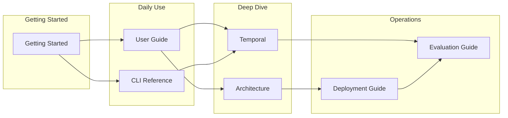

# LightRAG Documentation

**Complete guide to LightRAG: Temporal Retrieval-Augmented Generation system**

Latest: April 2026 | Status: Production-Ready | [GitHub](https://github.com/HKUDS/LightRAG)

---

## Core Documentation (7 Guides)

### 1. **[Getting Started](./GETTING_STARTED.md)**
Start here for first-time users. Covers installation, setup, and your first queries.

- Installation (PyPI, development, Docker)
- 5-minute quick setup
- Upload documents
- Run first query
- Frontend development guide
- Testing & validation

### 2. **[User Guide](./USER_GUIDE.md)**
Complete workflow guide for using LightRAG with best practices and advanced features.

- Document organization & upload
- Query modes (local, global, hybrid, agentic, naive, mix, bypass)
- Temporal queries with dates
- WebUI features & controls
- Workspace management
- Advanced usage patterns
- Batch processing

### 3. **[CLI Reference](./CLI_REFERENCE.md)**
Command-line interface guide for building graphs and querying from terminal.

- All CLI commands
- Global options & query modes
- MLflow tracing integration
- Common workflows

### 4. **[Architecture](./ARCHITECTURE.md)**
System architecture, design principles, and production considerations.

- Core principles (Split-Node, Sequence-First)
- Data lifecycle & processing pipeline
- Retrieval logic & max-sequence algorithm
- Storage backend matrix
- Production bottlenecks & scaling
- Performance optimization
- Monitoring & observability

### 5. **[Temporal](./TEMPORAL.md)**
Guide to temporal features: versioning, time-travel queries, and implementation details.

- Use cases (historical retrieval, audit, change tracking)
- Query modes & workflows
- API reference (Python, REST)
- Implementation details -- 27 issues fixed
- Production deployment
- Troubleshooting

### 6. **[Evaluation Guide](./EVALUATION_GUIDE.md)**
RAG quality evaluation using RAGAS metrics with temporal and workspace support.

- Semantic equivalence & RAGAS evaluation
- Temporal evaluation with reference dates
- Workspace-specific testing
- Custom dataset creation
- Performance metrics & best practices
- CLI reference & troubleshooting

### 7. **[Deployment Guide](./DEPLOYMENT_GUIDE.md)**
Production deployment, infrastructure setup, and operational procedures.

- Local development setup & Docker deployment
- LLM & storage backend configuration
- Production architecture & Kubernetes
- Pre-deployment checklist & rollback
- Performance profiling
- Monitoring & disaster recovery

---

## Quick Start

**For New Users:**
1. Go to [Getting Started](./GETTING_STARTED.md#installation)
2. Install: `pip install lightrag-hku[api]` OR develop mode: `pip install -e ".[api]"`
3. Start: `lightrag-server`
4. Open: http://localhost:5173
5. Upload documents and query

**For Production:**
1. Read [Deployment Guide](./DEPLOYMENT_GUIDE.md#production-deployment)
2. Configure `.env` with your LLM & storage backends
3. Run deployment checklist
4. Deploy with Docker or Kubernetes

**For CLI Users:**
1. Install: `pip install lightrag-hku[api]`
2. Build: `lightrag build --files *.pdf`
3. Query: `lightrag query "Your question"`
4. Interactive: `lightrag interactive`

---

## Documentation Map



---

## By Use Case

| I want to... | Read |
|-------------|------|
| Get started quickly | [Getting Started](./GETTING_STARTED.md) |
| Learn to query | [User Guide](./USER_GUIDE.md) |
| Use the CLI | [CLI Reference](./CLI_REFERENCE.md) |
| Deploy to production | [Deployment Guide](./DEPLOYMENT_GUIDE.md) |
| Understand the system | [Architecture](./ARCHITECTURE.md) |
| Query historical data | [Temporal](./TEMPORAL.md) |
| Test RAG quality | [Evaluation Guide](./EVALUATION_GUIDE.md) |

---

## Key Features

- **Temporal RAG** -- Query documents as they existed on any date
- **Version Tracking** -- Track all changes to entities across documents
- **Audit Trails** -- Complete history with sequence numbers
- **Multi-Mode Queries** -- Local, Global, Hybrid, Temporal, Naive, Mix, Bypass
- **Production Ready** -- Distributed locking, ACID transactions, monitoring
- **Scalable** -- 50+ concurrent users, millions of entities
- **Flexible Storage** -- Neptune, Neo4j, PostgreSQL, MongoDB, Milvus, OpenSearch, and more
- **Multiple LLM Providers** -- OpenAI, Anthropic, Azure, Ollama, Gemini, Bedrock, and more
- **Developer Friendly** -- Python SDK, REST API, CLI, WebUI

---

## Documentation Index

```
Getting Started       - Installation, setup, first query
User Guide           - Workflows, best practices, WebUI features
CLI Reference        - Command-line interface, all commands
Architecture         - System design, optimization, bottlenecks
Temporal             - Time-travel queries, versioning, API
Evaluation Guide     - RAG quality testing, RAGAS metrics, datasets
Deployment Guide     - Production setup, monitoring, troubleshooting
```

---

**Ready? -> [Getting Started](./GETTING_STARTED.md)**

**Want to deploy? -> [Deployment Guide](./DEPLOYMENT_GUIDE.md)**

**Learn the system? -> [Architecture](./ARCHITECTURE.md)**

---

**Last Updated:** April 22, 2026
