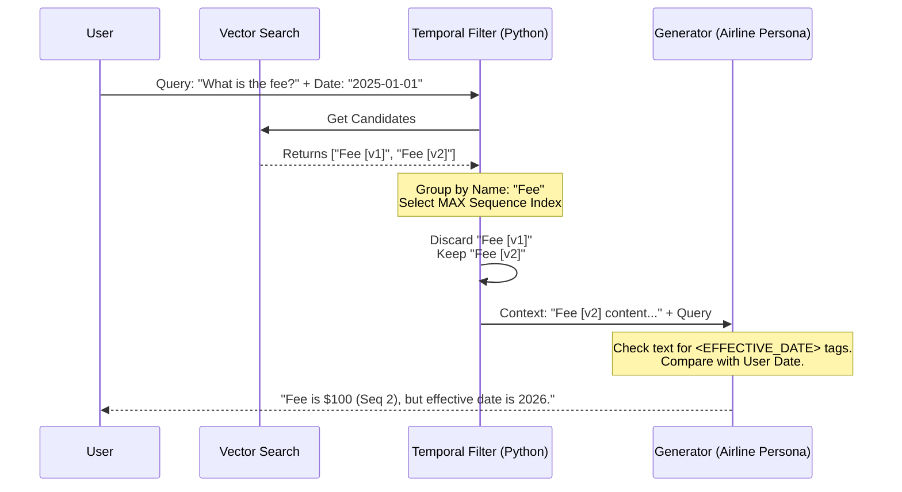

# Temporal Retrieval Logic

## Overview

LightRAG's temporal mode implements a **Max-Sequence Filtering Algorithm** that ensures queries return the most recent version of information while respecting temporal constraints. This document explains the retrieval pipeline and decision-making process.

---

## The Max-Sequence Algorithm

### Core Principle

When multiple versions of an entity exist in the knowledge graph:

1. **Group by Entity Name**: Collect all versions of the same entity (e.g., "Parking Fee [v1]", "Parking Fee [v2]")
2. **Select Maximum Sequence**: Choose the version with the highest `sequence_index`
3. **Validate Effective Date**: Check if the selected version's effective date matches the query reference date
4. **Return Result**: Provide the filtered context to the LLM for answer generation

### Algorithm Pseudocode

```python
def filter_temporal_results(candidates, reference_date=None):
    # Step 1: Group by canonical entity name
    entity_groups = {}
    for candidate in candidates:
        base_name = extract_base_name(candidate.name)  # "Parking Fee [v2]" → "Parking Fee"
        entity_groups.setdefault(base_name, []).append(candidate)
    
    # Step 2: Select max sequence for each group
    latest_versions = []
    for base_name, versions in entity_groups.items():
        latest = max(versions, key=lambda v: v.sequence_index)
        latest_versions.append(latest)
    
    # Step 3: Filter by effective date if provided
    if reference_date:
        valid_versions = [
            v for v in latest_versions
            if v.effective_date <= reference_date
        ]
        return valid_versions
    
    return latest_versions
```

---

## Retrieval Pipeline Visualization

The following sequence diagram illustrates the complete retrieval flow from user query to final answer:



---

## Detailed Step-by-Step Breakdown

### Step 1: Vector Search
**Input:** User query (e.g., "What are the latest parking fees?")  
**Process:**
- Convert query to embedding using the same model used for ingestion
- Perform similarity search in vector database
- Retrieve top-k candidates (default k=20)

**Output:** List of candidate text chunks with metadata:
```json
[
  {
    "content": "Parking fee is $50 per night...",
    "entity_name": "Parking Fee [v1]",
    "sequence_index": 1,
    "effective_date": "2024-01-01",
    "similarity_score": 0.89
  },
  {
    "content": "Parking fee updated to $100 per night...",
    "entity_name": "Parking Fee [v2]",
    "sequence_index": 2,
    "effective_date": "2025-06-15",
    "similarity_score": 0.91
  }
]
```

### Step 2: Temporal Filtering
**Input:** Candidates from vector search + optional `reference_date`  
**Process:**

1. **Entity Name Normalization**
   - Strip version suffixes: `"Parking Fee [v2]"` → `"Parking Fee"`
   - Handle variations: "overnight parking", "parking fees" → same group

2. **Sequence-Based Deduplication**
   - Group: `{"Parking Fee": [v1, v2]}`
   - Select: `max([1, 2])` → `v2`

3. **Effective Date Validation** (if `reference_date` provided)
   - If query date is `2025-01-01` and `effective_date` is `2025-06-15`
   - Mark as future-dated: Include in context but flag as "not yet effective"

**Output:** Filtered list of latest versions:
```json
[
  {
    "content": "Parking fee updated to $100 per night...",
    "entity_name": "Parking Fee [v2]",
    "sequence_index": 2,
    "effective_date": "2025-06-15",
    "temporal_status": "future"
  }
]
```

### Step 3: Context Assembly
**Input:** Filtered entities + user query  
**Process:**
- Combine filtered entities into a single context string
- Inject temporal metadata as XML tags
- Add system instructions for the airline persona

**Output:** Structured prompt:
```
<CONTEXT>
Parking Fee [Sequence 2, Effective 2025-06-15]:
"Parking fee updated to $100 per night for Boeing 787 aircraft..."
</CONTEXT>

<QUERY>
What are the latest parking fees as of 2025-01-01?
</QUERY>

<INSTRUCTIONS>
You are an airline operations assistant. Answer based on the provided context.
If effective dates are in the future, explicitly mention this in your response.
</INSTRUCTIONS>
```

### Step 4: LLM Generation
**Input:** Assembled prompt  
**Process:**
- LLM analyzes context for `<EFFECTIVE_DATE>` tags
- Compares query reference date with effective dates
- Generates natural language answer with version citations

**Output:** Final answer to user:
```
Based on the latest contract (Sequence 2), the parking fee is $100 per night 
for Boeing 787 aircraft. However, please note this rate becomes effective on 
June 15, 2025, which is after your query date of January 1, 2025.

The previous rate (Sequence 1) was $50 per night, effective January 1, 2024.
```

---

## Handling Edge Cases

### Case 1: No Effective Date Provided
**Scenario:** Document has no `<EFFECTIVE_DATE>` tag  
**Resolution:**
- Fall back to sequence index alone
- Assume effective immediately after ingestion
- Log warning for audit trail

### Case 2: Conflicting Versions with Same Sequence
**Scenario:** Multiple documents assigned the same sequence ID (error state)  
**Resolution:**
- Use lexicographic ordering of source filenames
- Log error for manual review
- Prefer document with latest ingestion timestamp

### Case 3: Query Date Before All Versions
**Scenario:** User asks about 2020, but earliest document is from 2023  
**Resolution:**
- Return empty results
- LLM responds: "No information available for the specified time period"

### Case 4: Future Effective Dates
**Scenario:** All versions have effective dates in the future  
**Resolution:**
- Include in results but mark as "pending"
- LLM explains: "These changes will take effect on [date]"

### Case 5: Partial Version Chains
**Scenario:** "Fee [v1]" exists, but "Fee [v2]" was deleted  
**Resolution:**
- Return v1 as the latest available
- Check SUPERSEDES relationships to detect gaps
- Log data integrity warning

---

## Performance Optimization

### Indexing Strategy
- **Primary Index**: Vector embeddings for semantic search
- **Secondary Index**: Sequence index for fast max-selection
- **Tertiary Index**: Effective date for range queries

### Caching
```python
@lru_cache(maxsize=1000)
def get_latest_version(entity_name, reference_date=None):
    # Cache results of temporal filtering
    return filtered_entity
```

### Batch Processing
For queries involving multiple entities:
```python
# Efficient: Single vector search, batch filtering
entities = vector_search(query, top_k=50)
filtered = batch_temporal_filter(entities, reference_date)

# Inefficient: Multiple searches (avoid)
for entity in entity_list:
    result = search_and_filter(entity)
```

---

## Configuration Options

Control retrieval behavior via `config.ini`:

```ini
[temporal_retrieval]
# Maximum candidates to retrieve from vector search
top_k = 20

# Enable strict effective date filtering
strict_date_filter = true

# Include superseded versions in context (for comparison)
include_history = false

# Fallback to latest if no version matches date
fallback_to_latest = true
```

---

## API Usage Examples

### Query with Temporal Filter

**Request:**
```python
POST /query
{
  "query": "What is the lavatory service fee?",
  "mode": "temporal",
  "reference_date": "2025-01-01",
  "working_dir": "data/output/contracts"
}
```

**Response:**
```json
{
  "answer": "The lavatory service fee is $75 (Sequence 3, Effective 2024-12-01).",
  "sources": [
    {
      "entity": "Lavatory Service Fee [v3]",
      "sequence": 3,
      "effective_date": "2024-12-01",
      "source_file": "rates_2025.pdf"
    }
  ],
  "temporal_status": "valid"
}
```

### Query Without Date (Latest Version)

**Request:**
```python
POST /query
{
  "query": "What is the lavatory service fee?",
  "mode": "temporal"
}
```

**Response:**
```json
{
  "answer": "The lavatory service fee is $80 (Sequence 4, Effective 2025-06-15).",
  "sources": [
    {
      "entity": "Lavatory Service Fee [v4]",
      "sequence": 4,
      "effective_date": "2025-06-15",
      "source_file": "amendment_2025_Q2.pdf"
    }
  ],
  "temporal_status": "future",
  "note": "This rate is not yet effective. Current rate is $75."
}
```

---

## Comparison with Non-Temporal Modes

| **Aspect**            | **Temporal Mode**                        | **Hybrid/Global Mode**              |
|-----------------------|------------------------------------------|-------------------------------------|
| **Duplicate Handling**| Max-sequence filtering                   | All versions treated as separate    |
| **Time Awareness**    | Respects effective dates                 | No temporal logic                   |
| **Answer Quality**    | Always latest version                    | May mix old and new information     |
| **Use Case**          | Version-controlled documents             | Static knowledge bases              |

---

## Debugging Tips

### Enable Verbose Logging
```bash
export LIGHTRAG_LOG_LEVEL=DEBUG
```

### Inspect Filtered Results
```python
from lightrag.operate import filter_temporal_results

candidates = [...] # From vector search
filtered = filter_temporal_results(candidates, reference_date="2025-01-01")
print(json.dumps(filtered, indent=2))
```

### Visualize Version Chains
```python
from lightrag.tools.visualize_graph import show_supersedes_chain

show_supersedes_chain("Parking Fee")
# Output: v1 → v2 → v3
```

---

## Next Steps

- **For architecture overview**: See [ARCHITECTURE.md](ARCHITECTURE.md)
- **For user instructions**: See [USER_GUIDE.md](USER_GUIDE.md)
- **For API details**: See [API_CHANGES.md](API_CHANGES.md)

---

**Max-Sequence Algorithm: Ensuring temporal consistency in retrieval-augmented generation.**
