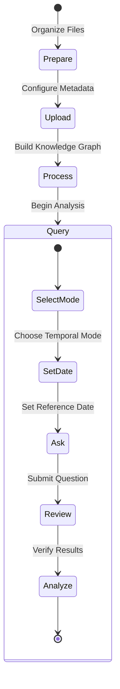

# LightRAG Comprehensive User Guide

## Overview

This guide covers all aspects of using LightRAG for temporal document processing and version-aware queries. It includes workflows, best practices, and advanced techniques.

---

## Complete Workflow



---

## Phase 1: Document Preparation

### Organizing Documents

LightRAG works best when documents are organized chronologically:

```
contracts/
├── 2023-base-contract.pdf       # Sequence 1
├── 2024-q2-amendment.pdf        # Sequence 2
├── 2024-q4-amendment.pdf        # Sequence 3
└── 2025-rates-update.pdf        # Sequence 4
```

**Document Types:**
- `base` - Original contract (foundation)
- `amendment` - Change to existing contract
- `supplement` - Additional clauses
- `addendum` - Supplementary terms
- `revision` - Complete rewrite

### Extracting Effective Dates

The system automatically extracts effective dates from document content:

```markdown
# Example Document Header

Effective Date: 2024-06-15
Document Type: Amendment
Contract #: CW-2024-001

## Terms and Conditions
...
```

The system looks for dates in standard formats:
- "Effective as of 2024-06-15"
- "Commencing on June 15, 2024"
- "Dated: 2024-06-15"

---

## Phase 2: Document Upload

### Option A: Web Interface (Recommended for Users)

**Staging Area Workflow:**

1. **Open Staging Area**
   - Navigate to Documents tab
   - Click "Staging Area" button

2. **Add Files**
   - Drag and drop PDFs
   - Or click "Browse" to select files
   - Files appear in list

3. **Organize Sequence**
   - Drag to reorder (earliest → latest)
   - Visual indicator shows "v1", "v2", etc.
   - Or use Move Up/Down buttons

4. **Set Metadata**
   - Enter effective date for each file
   - Select document type (auto-detected)
   - Contract number appears if recognized

5. **Upload**
   - Click "Upload All"
   - Progress bar shows status
   - Confirmation when complete

### Option B: API (For Integration)

**Single File:**
```bash
curl -X POST "http://localhost:9621/upload" \
  -F "file=@contract.pdf" \
  -F "sequence_index=1" \
  -F "effective_date=2024-01-01" \
  -F "doc_type=base"
```

**Batch Upload:**
```bash
curl -X POST "http://localhost:9621/upload" \
  -F "file=@base.pdf" \
  -F "file=@amendment.pdf" \
  -F "sequence_map={
    \"base.pdf\": 1,
    \"amendment.pdf\": 2
  }"
```

### Option C: Python SDK

```python
from lightrag import LightRAG, QueryParam
from data_prep import ContractSequencer

# Step 1: Prepare documents
sequencer = ContractSequencer(
    files=["base.pdf", "amendment.pdf", "update.pdf"],
    order=["base.pdf", "amendment.pdf", "update.pdf"]
)
docs = sequencer.prepare_for_ingestion()

# Step 2: Insert into LightRAG
rag = LightRAG(working_dir="./rag_storage")
await rag.initialize_storages()

for doc in docs:
    await rag.ainsert(
        input=doc["content"],
        metadata=doc["metadata"]
    )
```

### Option D: CLI

```bash
# Batch ingest
python build_graph.py \
  --input-dir ./contracts \
  --output-dir ./rag_storage \
  --mode temporal
```

---

## Phase 3: Knowledge Graph Building

### What Happens During Processing

**Stage 1: Text Extraction**
- PDF/DOCX text converted to plain text
- Formatting and structure preserved where relevant

**Stage 2: Tagging**
- NLP extracts effective dates
- Document type auto-inferred
- Key metadata identified

**Stage 3: Entity Extraction**
- LLM identifies entities (fees, services, clauses)
- Versioning prompt ensures unique names
- Example: "Parking Fee" becomes "Parking Fee [v1]", "Parking Fee [v2]"

**Stage 4: Versioning**
- Creates separate entity nodes per version
- Establishes SUPERSEDES relationships
- Maintains complete change history

**Stage 5: Graph Storage**
- Entities and relationships stored
- Indexed for vector search
- Ready for queries

### Monitoring Progress

**Web UI:**
Watch the progress bar and status indicator

**CLI:**
```bash
python query_graph.py --stats
```

**Python:**
```python
result = await rag.aquery(
    "*",
    param=QueryParam(mode="local")
)
print(f"Total entities: {len(result['entities'])}")
```

---

## Phase 4: Querying

### Query Modes

**Local Mode** - Single-hop graph traversal (fast, entity-focused)
```python
result = await rag.aquery(
    "What is the parking fee?",
    param=QueryParam(mode="local")
)
```

**Global Mode** - Multi-hop graph traversal (comprehensive)
```python
result = await rag.aquery(
    "What services are included with parking?",
    param=QueryParam(mode="global")
)
```

**Hybrid Mode** - Balanced combination (recommended default)
```python
result = await rag.aquery(
    "What are all the fees and services?",
    param=QueryParam(mode="hybrid")
)
```

**Temporal Mode** - Version-aware with date filtering (NEW)
```python
result = await rag.aquery(
    "What is the parking fee?",
    param=QueryParam(
        mode="temporal",
        reference_date="2024-06-01"
    )
)
```

### Temporal Queries

#### Basic Temporal Query
```python
# Get latest version
result = await rag.aquery(
    "What is the current parking fee?",
    param=QueryParam(mode="temporal")
)
```

#### Query as of Specific Date
```python
# Get state on Jan 1, 2024
result = await rag.aquery(
    "What was the parking fee?",
    param=QueryParam(
        mode="temporal",
        reference_date="2024-01-01"
    )
)
```

#### Track Changes Over Time
```python
# Get version comparison
result = await rag.aquery(
    "How did the parking fee change?",
    param=QueryParam(
        mode="temporal",
        reference_date="2025-01-01"  # Latest
    )
)
```

### Query Examples

**Example 1: Simple Fee Query**
```
Question: "What is the landing fee for Boeing 787?"
Response: "The landing fee for Boeing 787 is $3,200 per landing 
(Effective January 1, 2025)"
```

**Example 2: Historical Query**
```
Question: "What was the fee in March 2024?"
Reference Date: 2024-03-31
Response: "In March 2024, the landing fee was $2,800 per landing"
```

**Example 3: Complex Multi-Entity Query**
```
Question: "What are the latest rates for Boeing 787 flights that 
remain overnight and undergo cabin cleaning with lavatory service?"

Response: Structured table with:
- Boeing 787 – RON: $100/night
- Cabin Cleaning: $500/service
- Lavatory Service: $75/service
- Total: $675/overnight stay
```

---

## Response Formats

### Mode A: Quantitative (Fees, Rates, Dates)

LightRAG returns crisp, structured data:

```
| Item | Rate | Unit | Effective |
|------|------|------|-----------|
| Parking | $200 | /night | 2025-01-01 |
| Cleaning | $500 | /service | 2025-01-01 |
```

**When to use:** Budget analysis, cost comparisons, rate lookups

### Mode B: Qualitative (Clauses, Conditions, Liability)

LightRAG returns structured analysis:

```
**Executive Summary**
The contract permits termination if the vendor fails to perform 
for 30 consecutive days after written notice.

**Detailed Analysis**
- Prerequisites: Written notice required
- Grace period: 30 consecutive days
- Cost: May incur separation fees

**Critical Constraints**
- Vendor has right to cure
- Force majeure exceptions apply
- Advance written notice mandatory
```

**When to use:** Legal review, compliance verification, risk analysis

---

## Best Practices

### Document Organization
✅ **Do:**
- Organize chronologically (oldest → newest)
- Use clear file names indicating date/version
- Include metadata in document headers
- Group related amendments together

❌ **Don't:**
- Mix unrelated contracts together
- Reorder documents randomly
- Lose track of effective dates
- Upload documents out of order

### Query Construction
✅ **Do:**
- Be specific about dates
- Ask about one topic per query
- Include relevant entity names
- Specify mode if not using default

❌ **Don't:**
- Ask vague questions
- Request multiple unrelated items
- Assume default date
- Forget reference date for temporal queries

### Verification
✅ **Do:**
- Check version citations in answers
- Verify effective dates match queries
- Compare results across dates
- Review source references

❌ **Don't:**
- Trust answers without verification
- Ignore future-dated clauses
- Assume single version exists
- Skip source checking

---

## Advanced Usage

### Batch Processing

```python
# Process multiple documents efficiently
documents = ["doc1.pdf", "doc2.pdf", "doc3.pdf"]

for i, doc_path in enumerate(documents, 1):
    with open(doc_path) as f:
        content = f.read()
    
    await rag.ainsert(
        input=content,
        metadata={
            "sequence_index": i,
            "effective_date": extract_date(doc_path),
            "doc_type": infer_type(doc_path)
        }
    )
```

### Custom Chunking

```python
from lightrag.hierarchical_chunker import create_hierarchical_chunking_func

# Use specialized YAML-aware chunking
chunking_func = create_hierarchical_chunking_func(
    chunk_size=2000,
    chunk_overlap=200
)

rag = LightRAG(
    working_dir="./rag_storage",
    chunking_func=chunking_func
)
```

### Caching Control

Different reference dates produce different cache entries:

```python
# First query (cached)
result1 = await rag.aquery(
    "What is the fee?",
    param=QueryParam(mode="temporal", reference_date="2024-01-01")
)

# Different date = different cache entry
result2 = await rag.aquery(
    "What is the fee?",
    param=QueryParam(mode="temporal", reference_date="2024-06-01")
)

# Same query and date = uses cache
result3 = await rag.aquery(
    "What is the fee?",
    param=QueryParam(mode="temporal", reference_date="2024-01-01")
)
```

### Debugging Queries

Enable detailed logging:

```python
import logging

logging.basicConfig(level=logging.DEBUG)
logger = logging.getLogger("lightrag")

# Queries now show detailed processing steps
result = await rag.aquery("What is the fee?", param=QueryParam(mode="temporal"))
```

---

## Troubleshooting

### Issue: Versioned entities not being created

**Symptoms:** All entities merged into single nodes

**Solutions:**
1. Check `sequence_index > 0` in metadata
2. Verify LLM is following versioning prompt
3. Check LLM model (GPT-4 recommended)
4. Review entity extraction logs

```bash
# Enable debug logging
export LIGHTRAG_LOG_LEVEL=DEBUG
python query_graph.py --stats
```

### Issue: Temporal queries returning old versions

**Symptoms:** Query returns v1 when expecting v2

**Solutions:**
1. Verify `reference_date` format (YYYY-MM-DD)
2. Check `<EFFECTIVE_DATE>` tags in content
3. Confirm sequence_index progression
4. Clear cache if recently updated

```bash
# Check entity metadata
python query_graph.py --query "*" --mode local
```

### Issue: Missing effective dates in results

**Symptoms:** Dates not shown in response

**Solutions:**
1. Verify dates are in document content
2. Check soft tag injection (should see `<EFFECTIVE_DATE>` tags)
3. Ensure LLM can interpret tags
4. Review prompt instructions

### Issue: Performance degradation

**Symptoms:** Queries slow with many documents

**Solutions:**
1. Increase `CHUNK_SIZE` (default 1024)
2. Use hierarchical chunking for structured data
3. Reduce `MAX_ASYNC` if rate-limited
4. Enable caching (automatic)

---

## Performance Tuning

### For Large Datasets (1000+ documents)
```python
rag = LightRAG(
    working_dir="./rag_storage",
    chunk_size=2000,
    max_async=8,
    max_parallel_insert=4
)
```

### For Real-Time Queries
- Use caching (automatic)
- Prefer `local` mode over `global`
- Set smaller `reference_date` range
- Use `hybrid` mode for balance

### For Memory Efficiency
```bash
export MAX_ASYNC=2           # Lower concurrency
export CHUNK_SIZE=1024       # Smaller chunks
export MAX_PARALLEL_INSERT=1 # Single document at a time
```

---

## Reference

- **System Architecture** → [ARCHITECTURE.md](ARCHITECTURE.md)
- **API Documentation** → [API_REFERENCE.md](API_REFERENCE.md)
- **Retrieval Algorithm** → [RETRIEVAL_LOGIC.md](RETRIEVAL_LOGIC.md)
- **Getting Started** → [GETTING_STARTED.md](GETTING_STARTED.md)
- **Deployment** → [DEPLOYMENT_GUIDE.md](DEPLOYMENT_GUIDE.md)

---

## Testing

```bash
# Comprehensive test suite
uv run test_prep.py              # Sequencing
uv run test_ingest.py            # Versioning
uv run test_temporal.py          # Temporal queries
uv run test_temporal_persona.py  # Response formats
uv run test_soft_tags.py         # Soft tagging

# End-to-end demo
uv run demo_temporal_rag.py
```

---

**Need help? Check [GETTING_STARTED.md](GETTING_STARTED.md) or [ARCHITECTURE.md](ARCHITECTURE.md)**
