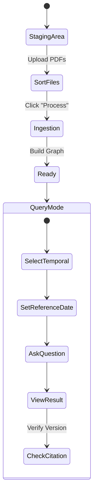

# LightRAG Temporal User Guide

## Overview

This guide walks you through using LightRAG's temporal features for time-aware document search and retrieval. You'll learn how to upload contracts, sequence them properly, and query for information as it existed at specific points in time.

---

## Prerequisites

- LightRAG installed and running (see main [README.md](../README.md))
- FastAPI server started: `lightrag-server` or `uvicorn lightrag.api.lightrag_server:app --reload`
- Web UI running (optional): `cd lightrag_webui && bun run dev`
- Python environment configured with required dependencies

---

## Getting Started

### Step 1: Launch the System

**Option A: Using the Web UI**
```bash
# Terminal 1: Start API server
lightrag-server

# Terminal 2: Start React UI
cd lightrag_webui
bun run dev
```

Open browser to `http://localhost:5173`

**Option B: Using the CLI**
```bash
# Activate Python environment
source .venv/bin/activate

# Run query script directly
python query_graph.py --mode temporal --query "Your question here"
```

---

## User Journey: State Diagram

The following diagram illustrates the complete workflow from document upload to answer retrieval:



---

## Detailed Workflow

### Phase 1: Staging Area

#### Uploading Documents

**Via Web UI:**
1. Navigate to the **Staging Area** tab
2. Drag and drop PDF files into the upload zone
3. Files appear in a sortable list

**Via API (cURL):**
```bash
curl -X POST "http://localhost:8020/upload" \
  -F "file=@contract_2023.pdf" \
  -F "sequence_map={\"contract_2023.pdf\": 1}"
```

**Via Python:**
```python
import requests

files = {"file": open("contract_2023.pdf", "rb")}
data = {"sequence_map": '{"contract_2023.pdf": 1}'}

response = requests.post(
    "http://localhost:8020/upload",
    files=files,
    data=data
)
print(response.json())
```

#### Sorting Documents

**Purpose:** Establish the correct chronological order of contracts and amendments.

**Web UI Steps:**
1. Review uploaded files in the staging table
2. Drag to reorder (earliest document first)
3. Sequence numbers auto-assign (1, 2, 3, ...)
4. Verify sequence in the **Seq ID** column

**Manual Sequence Assignment:**
If you know the order in advance:
```json
{
  "base_contract_2023.pdf": 1,
  "amendment_Q2_2024.pdf": 2,
  "amendment_Q4_2024.pdf": 3,
  "latest_rates_2025.pdf": 4
}
```

---

### Phase 2: Ingestion (Build Graph)

#### Processing Documents

**Web UI:**
1. Click **"Process All"** button
2. Progress bar shows:
   - Text extraction
   - Entity detection
   - Graph construction
3. Status changes to **"Ready"** when complete

**CLI:**
```bash
python build_graph.py \
  --mode temporal \
  --input-dir data/raw/contracts \
  --output-dir data/output/contracts \
  --sequence-map '{"contract_2023.pdf": 1, "amendment_2024.pdf": 2}'
```

**What Happens Behind the Scenes:**
1. **Text Extraction**: PDFs converted to plain text
2. **Tagging**: NLP extracts effective dates → `<EFFECTIVE_DATE>2025-06-15</EFFECTIVE_DATE>`
3. **Entity Extraction**: LLM identifies entities (fees, services, aircraft types)
4. **Versioning**: Creates split nodes: `"Parking Fee [v1]"`, `"Parking Fee [v2]"`
5. **Graph Storage**: Nodes and relationships saved to configured backend (NetworkX, Neo4j, etc.)

#### Verifying Ingestion

**Check Log Output:**
```
INFO: Processed 4 documents
INFO: Created 87 entity nodes (23 versioned)
INFO: Established 142 relationships
INFO: Graph ready for queries
```

**Inspect via CLI:**
```bash
python query_graph.py --mode temporal --stats
```

**Expected Output:**
```
Total Entities: 87
Versioned Entities: 23
Sequence Range: 1-4
Effective Date Range: 2023-01-01 to 2025-12-31
```

---

### Phase 3: Query Mode

#### Selecting Temporal Mode

**Web UI:**
1. Navigate to **Query** tab
2. Select **"Temporal"** from mode dropdown
3. Optional: Enable **"Set Reference Date"** toggle

**CLI:**
```bash
python query_graph.py --mode temporal --working-dir data/output/contracts
```

#### Setting Reference Date

**Purpose:** Retrieve information as it existed on a specific date.

**Web UI:**
1. Toggle **"Reference Date"** switch
2. Use date picker to select target date (e.g., `2025-01-01`)
3. Date appears in query context

**CLI:**
```bash
python query_graph.py \
  --mode temporal \
  --reference-date 2025-01-01 \
  --query "What was the parking fee?"
```

**Behavior:**
- **Without date**: Returns the absolute latest version (highest sequence)
- **With date**: Returns the latest version effective on or before that date

#### Asking Questions

**Example Queries:**

1. **Simple Entity Lookup:**
   ```
   "What is the parking fee for Boeing 787?"
   ```

2. **Time-Specific Query:**
   ```
   "What was the lavatory service fee as of January 1, 2025?"
   ```

3. **Complex Multi-Entity Query:**
   ```
   "What are the latest rates for Boeing 787 flights that remain 
    overnight and undergo cabin cleaning with lavatory service?"
   ```

4. **Version Comparison:**
   ```
   "How has the parking fee changed over time?"
   ```

#### Interpreting Results

**Sample Answer (Web UI):**
```
Based on the latest contract (Sequence 3, Effective 2024-12-01), 
the lavatory service fee is $75 per service for Boeing 787 aircraft.

Sources:
- Lavatory Service Fee [v3] (Seq 3, rates_2025.pdf)
- Boeing 787 Aircraft Type [v2] (Seq 2, amendment_2024.pdf)
```

**CLI Output:**
```json
{
  "answer": "The lavatory service fee is $75.",
  "mode": "temporal",
  "sources": [
    {
      "entity": "Lavatory Service Fee [v3]",
      "sequence": 3,
      "effective_date": "2024-12-01",
      "file": "rates_2025.pdf"
    }
  ]
}
```

#### Checking Citations

**Verify Version Accuracy:**
1. Look for sequence numbers in answer (e.g., `Seq 3`)
2. Cross-reference with source document
3. Check effective date against query date

**Web UI Features:**
- Click citation links to view source document
- Hover over entity names to see version history
- Expand **"Show Details"** for full metadata

---

## Advanced Features

### Comparing Versions

**CLI Command:**
```bash
python tools/compare_versions.py \
  --entity "Parking Fee" \
  --version-a 1 \
  --version-b 2
```

**Output:**
```diff
- Parking Fee [v1]: $50 per night (Effective 2024-01-01)
+ Parking Fee [v2]: $100 per night (Effective 2025-06-15)

Changes: +$50 increase
```

### Visualizing the Knowledge Graph

**Web UI:**
1. Navigate to **Graph View** tab
2. Select entity type filter (e.g., "Fees")
3. View interactive node graph
4. Click nodes to see version chains

**CLI (Generate HTML):**
```bash
python examples/graph_visual_with_html.py \
  --working-dir data/output/contracts \
  --output graph.html
```

**CLI (Using Neo4j):**
```bash
python examples/graph_visual_with_neo4j.py
```
Open Neo4j Browser and run:
```cypher
MATCH (n)-[r:SUPERSEDES]->(m)
RETURN n, r, m
```

### Exporting Results

**Save Query Results to JSON:**
```bash
python query_graph.py \
  --mode temporal \
  --query "What is the fee?" \
  --output results.json
```

**Batch Queries:**
```bash
# Create queries.txt with one question per line
python tools/batch_query.py \
  --input queries.txt \
  --output batch_results.csv \
  --mode temporal \
  --reference-date 2025-01-01
```

---

## Configuration Tips

### Choosing the Right Mode

| **Mode**       | **Use Case**                                                  |
|----------------|---------------------------------------------------------------|
| **Naive**      | Simple keyword search (no graph, baseline)                    |
| **Local**      | Single-hop entity retrieval (fast)                            |
| **Global**     | Multi-hop reasoning across entities (slow, comprehensive)     |
| **Hybrid**     | Balanced local + global search                                |
| **Temporal**   | Version-aware queries with effective date filtering           |

### Optimizing Performance

**For Large Document Sets:**
```ini
# config.ini
[embedding]
batch_size = 32  # Process multiple documents in parallel

[temporal]
max_versions_per_entity = 5  # Limit version history depth
cache_enabled = true
```

**Vector Database Selection:**
- **Small datasets (<1000 docs)**: NetworkX (default)
- **Medium datasets (<10,000 docs)**: Milvus or Qdrant
- **Large datasets (>10,000 docs)**: Qdrant or Elasticsearch

---

## Troubleshooting

### Issue: "No results found"

**Possible Causes:**
1. Working directory incorrect
2. No documents match the query date
3. Entities not extracted during ingestion

**Solutions:**
```bash
# Verify working directory has graph data
ls data/output/contracts/

# Check ingestion logs
tail -f lightrag.log

# Re-run ingestion with verbose logging
python build_graph.py --mode temporal --verbose
```

### Issue: "Version mismatch"

**Symptom:** Answer cites an old version when a newer one exists.

**Diagnosis:**
```bash
python tools/debug_temporal.py \
  --entity "Parking Fee" \
  --reference-date 2025-01-01
```

**Fix:**
- Verify sequence assignment: `sequence_map` may be incorrect
- Check effective dates: Tags may be malformed
- Rebuild graph: `python build_graph.py --force-rebuild`

### Issue: "Effective date not recognized"

**Symptom:** Temporal filtering ignores date constraints.

**Check:**
1. Date format must be `YYYY-MM-DD`
2. XML tags correctly formatted: `<EFFECTIVE_DATE>2025-01-01</EFFECTIVE_DATE>`
3. NLP tagger enabled: `config.ini` → `[temporal] track_effective_dates = true`

**Test Tagging:**
```bash
python data_prep.py --input contract.pdf --output tagged.txt
cat tagged.txt | grep "EFFECTIVE_DATE"
```

---

## Best Practices

### Document Naming Conventions

Use descriptive, sortable filenames:
```
✅ Good:
- 2023-01-15_base_contract.pdf
- 2024-06-01_amendment_Q2.pdf
- 2025-01-01_latest_rates.pdf

❌ Avoid:
- contract.pdf
- new_version.pdf
- final_FINAL_v3.pdf
```

### Sequence Assignment Strategy

**Option 1: Chronological (Recommended)**
- Assign sequences based on document date
- Earliest = 1, latest = N

**Option 2: Importance-Based**
- Base contract = 1
- Major amendments = 2, 3, ...
- Minor updates = later sequences

**Option 3: Manual Override**
- Use API to set explicit sequences
- Useful when ingesting documents out of order

### Query Phrasing

**Effective Queries:**
- Be specific about entities: "Boeing 787" not "aircraft"
- Include context: "lavatory service fee" not "fee"
- Use natural language: "What is..." not "query:fee"

**Less Effective:**
- Overly broad: "Tell me about contracts"
- Ambiguous: "What changed?"
- Keyword-only: "fee, parking, 787"

---

## Next Steps

- **Understand the architecture**: See [ARCHITECTURE.md](ARCHITECTURE.md)
- **Deep dive into retrieval**: See [RETRIEVAL_LOGIC.md](RETRIEVAL_LOGIC.md)
- **Explore API endpoints**: See [API_CHANGES.md](API_CHANGES.md)
- **Try advanced examples**: See [examples/](../examples/) directory

---

## Support

For issues, questions, or feature requests:
- GitHub Issues: [HKUDS/LightRAG](https://github.com/HKUDS/LightRAG/issues)
- Documentation: [docs/](../docs/)
- Example Scripts: [examples/](../examples/)

---

**Happy querying! 🚀 The knowledge graph remembers everything, so you don't have to.**
